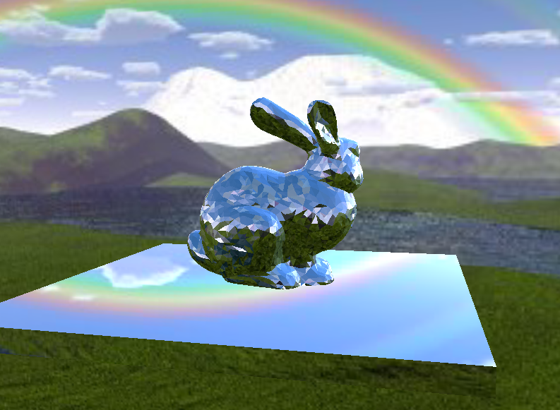
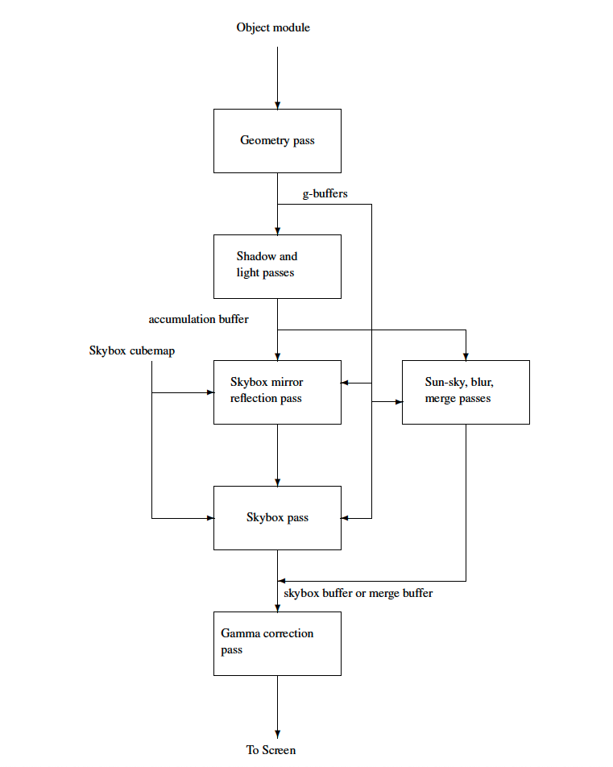
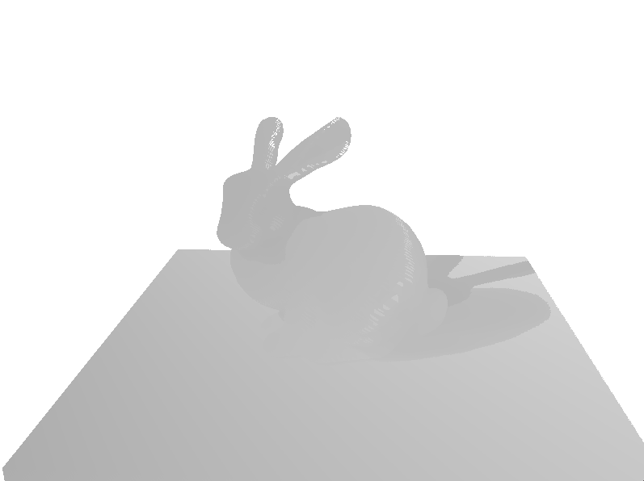
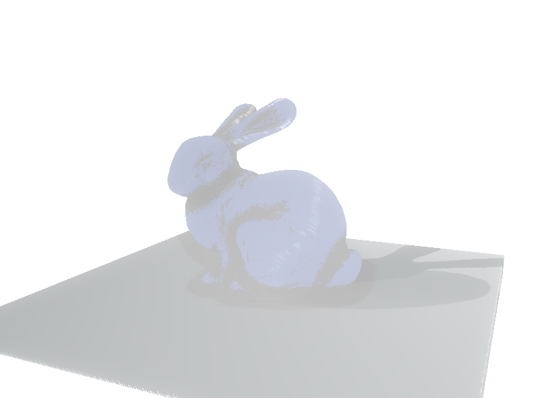
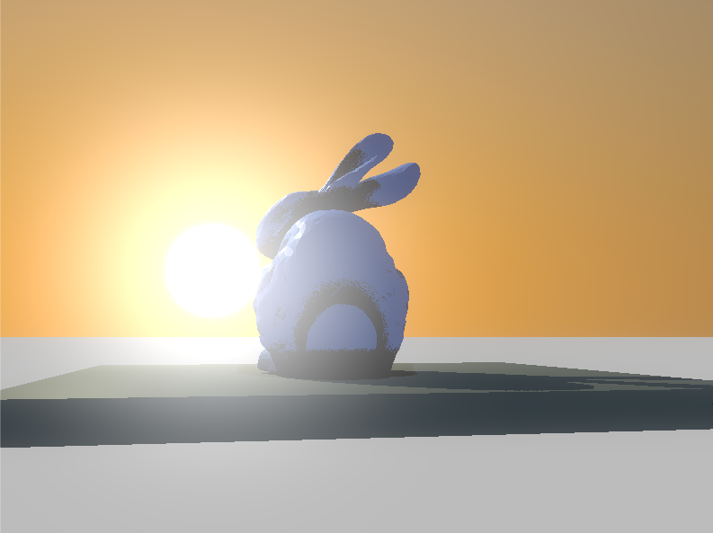
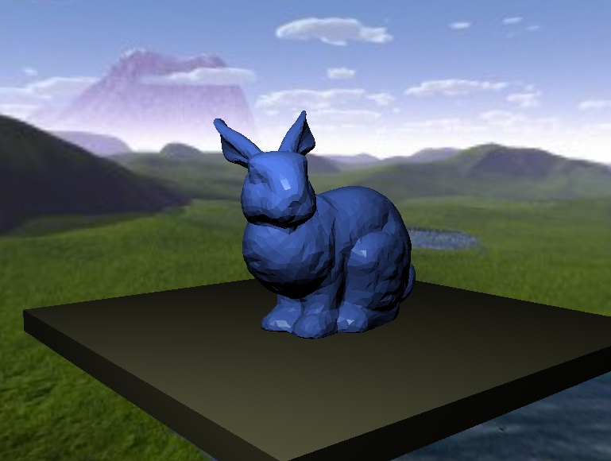
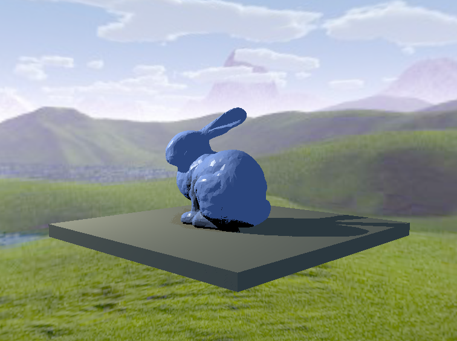

# Introduction

This program is a simple rasterization engine that takes in a .dae or .obj file, its corresponding .json info file, and a skybox to output an interactive window showcasing the scene.

# Pipeline Overview

# Geometry Pass

The geometry pass, performed by the fragment shader
`geopass.fs`, requires a diffuse reflectance, and three
`float`’s: alpha, eta, and k\_s, in order to produce 4
`vec3`’s for the g-buffers: `gNormal` (surface
normals), `gDiffuse_r`, `gAlpha` ( =
`vec3(alpha, eta, k_s)`, and `gConvert`, with
each element of `gConvert` equaling 1 if the corresponding
element in `gAlpha` is flipped. In order to make sure that
all of the g-buffer values are in the range \([0,1]\), I stored
`gNormal` as `(vNormal + 1.0) / 2.0` with
`vNormal` as the vertex normal in world space. If
`alpha > 1.0` then I set `gAlpha.x = 1.0/alpha` and
`gConvert.x = 1.0`; similarly for `eta` and
`k_s`. The result is the following image showing all four
g-buffers:

# Shadow Pass

For each point light, I rendered the geometry using the light position
as the camera position and generated a shadow-map buffer.

# Lighting Pass

## Point light

For each point light, I used the g-buffers and the shadow map as the
input to generate the light and shadow effects. The result is blended
into the accumulation buffer including diffuse reflection and specular
reflection.

## Ambient Light

For each ambient light, the program calculates the ambient occlusion
effect by sampling random points within a hemisphere on top of the
fragment. If a point is within the geometry, it will be counted as
ambient occlusion.

## Sun Sky

This adds the sun-sky effect using the Preetham model.

# Blur Pass and Merge Pass

The blur pass executes 4 blurs each with a horizon blur pass and a
vertical blur pass:

  - blur1: standard deviation: 6.2, radius: 24, mipmap level 1

  - blur2: standard deviation: 24.9 radius: 80, mipmap level 2

  - blur3: standard deviation: 81.0, radius: 243, mipmap level 3

  - blur4: standard deviation: 263, radius: 799, mipmap level 4

The result of each blur is saved into a mipmap of the temporary frame
buffer.  
The merge pass merges the above 4 blur results and the original image
with the weighted factors using the Spencer model:  
$0.8843g(x) + 0.1g(6.2,x) + 0.012g(24.9,x) + 0.0027g(81.0,x) + 0.001(263,x)$ 
The result is saved into a frame buffer called mergebuffer.

# Gamma Correction Pass

This reads from the merge buffer, performs the gamma correction, and
renders the image to screen.

# Skybox Implementation

The skybox and its mirror reflection are added to both
the forward and deferred renderer. In particular, a separate "skybox
pass" is added to draw the skybox images. To optimize the performance,
the depth value z for a pixel is always set to w (which is 1) in the
skybox vertex shader such that the skybox pixel will not be drawn if
there are anything in front of to it. The depth test is enabled and
`GL_LEQUAL` is set for depth function before the rendering.

For the reflection in deferred rendering, a separate "skybox mirror
reflection" pass is added, where the normals from the g-buffers
generated by the geometry pass are used to calculate the reflection
vectors in the fragment shader. The reflection vector is used to sample
the skybox for pixel color, followed by the mirror reflection color
being added to the existing pixel color, as generated by the light and
shadow passes to form the final color for the pixel.

